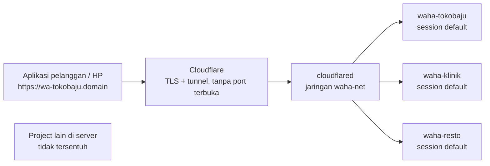
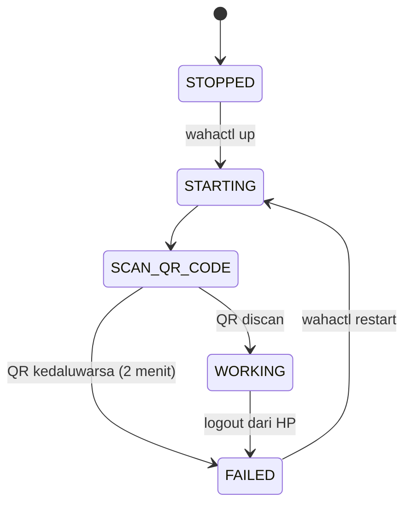

# Manual Operator WAHA

Cara menjalankan API WhatsApp untuk banyak bisnis di satu server: dari menambah
pelanggan baru, memasangkan nomor, mengirim dan menerima pesan, sampai
menangani masalah yang biasa muncul.

> Semua kunci, password, dan alamat server di dokumen ini sengaja diganti
> placeholder (`<API-KEY>`, `<IP-SERVER>`, `<domain>`). Nilai aslinya ada di
> `/opt/waha/instances/<nama>/.env` di server, jangan pernah ditulis ke repo.

**Isi**

1. [Peta mental](#peta-mental-server-instance-session)
2. [Yang kamu punya](#yang-kamu-punya)
3. [Menambah pelanggan baru](#menambah-pelanggan-baru)
4. [Status session](#status-session-dan-artinya)
5. [Mengirim pesan](#mengirim-pesan-lewat-api)
6. [Menerima pesan](#menerima-pesan-masuk-webhook)
7. [Format nomor](#format-nomor-tujuan)
8. [Perintah harian](#perintah-harian)
9. [Kalau bermasalah](#kalau-bermasalah)
10. [Kunci dan keamanan](#kunci-dan-keamanan)
11. [Backup dan kapasitas](#backup-update-dan-kapasitas)

---

## Peta mental: server, instance, session

Tiga kata ini yang bikin bingung di awal. Begitu paham urutannya, sisanya
mengikuti sendiri.

| Istilah | Artinya | Contoh |
| --- | --- | --- |
| **Server** | Satu komputer di cloud. Menampung semuanya. | `<IP-SERVER>` |
| **Instance** | Satu container WAHA. Punya alamat, kunci, dan penyimpanan sendiri. Satu instance = satu pelanggan. | `waha-tokobaju` |
| **Session** | Pendaftaran nomor WhatsApp lewat scan QR. Di dalam instance namanya selalu `default`. | `default` |

Satu server menampung banyak instance, dan tiap instance memegang satu nomor
WhatsApp. Pelanggan cukup tahu dua hal: alamat API dan kunci API miliknya.



Tiap instance terpisah: satu bermasalah, yang lain tetap jalan.

---

## Yang kamu punya

| | |
| --- | --- |
| Masuk ke server | `ssh -i ~/.ssh/<kunci-server>.key ubuntu@<IP-SERVER>` |
| Domain API | tiap pelanggan dapat `wa-<nama>.<domain>` |
| Perkakas | `sudo wahactl` — semua operasi lewat sini |
| Berkas instance | `/opt/waha/instances/<nama>/` |
| Mesin WhatsApp | GOWS — ringan, ±330 MB per nomor |

**Kenapa selalu pakai `sudo`.** Folder `/opt/waha` milik `root` supaya berkas
`.env` yang berisi kunci API tidak bisa dibaca pengguna lain di server.

---

## Menambah pelanggan baru

Contohnya pelanggan bernama `tokobaju`.

### 1. Jalankan satu perintah

```bash
ssh -i ~/.ssh/<kunci-server>.key ubuntu@<IP-SERVER>
sudo wahactl add tokobaju
```

Perintah ini membuat instance, menjalankannya, membuat subdomain
`wa-tokobaju.<domain>` beserta rute Cloudflare dan DNS-nya, lalu memastikan
alamatnya sudah menjawab dari internet. Sekitar 15 detik.

### 2. Simpan kredensial yang tercetak

```
API URL   : https://wa-tokobaju.<domain>
API key   : <API-KEY>
Dashboard : https://wa-tokobaju.<domain>/dashboard
User/pass : admin / <PASSWORD>
```

Kalau hilang, ambil lagi:

```bash
sudo grep -E 'API_KEY|PASSWORD' /opt/waha/instances/tokobaju/.env
```

### 3. Siapkan HP dulu, baru buka QR

QR WhatsApp kedaluwarsa sekitar dua menit. Buka WhatsApp di HP nomor itu →
*Perangkat Tertaut* → *Tautkan Perangkat*, baru kemudian buka dashboard.

### 4. Sambungkan dashboard, lalu scan

Buka `https://wa-tokobaju.<domain>/dashboard` (login `admin` + password dari
langkah 2). Di baris Workers, klik **ikon kunci** dan tempel API key — tanpa ini
dashboard menampilkan *not connected* karena ditolak `401`. Setelah tersambung,
session `default` muncul; klik tombol mulai lalu scan QR-nya.

Lewat terminal juga bisa — `sudo wahactl qr tokobaju` menyimpan `qr.png` di
folder instance.

### 5. Pastikan berstatus WORKING

```bash
sudo wahactl status tokobaju
# WORKING = nomor siap kirim/terima pesan
```

**Pelanggan berhenti berlangganan:** `sudo wahactl rm tokobaju` menghapus
container, data pairing, rute tunnel, dan record DNS sekaligus.

---

## Status session dan artinya



| Status | Artinya | Yang perlu dilakukan |
| --- | --- | --- |
| `WORKING` | Nomor tersambung, siap kirim dan terima. | Tidak ada. |
| `SCAN_QR_CODE` | Menunggu QR discan dari HP. | Scan sekarang, sebelum dua menit. |
| `STARTING` | Sedang menyalakan mesin WhatsApp. | Tunggu beberapa detik. |
| `STOPPED` | Session sengaja dihentikan. | `sudo wahactl restart <nama>` |
| `FAILED` | QR kedaluwarsa, atau nomor di-logout dari HP. | Restart, lalu scan ulang. |
| `PASSKEY_REQUIRED` | WhatsApp minta konfirmasi passkey saat pairing. | Ikuti perintah di layar HP. |

Melihat semua sekaligus: `sudo wahactl ls`.

---

## Mengirim pesan lewat API

Semua permintaan butuh dua hal: header `X-Api-Key` dan field
`"session": "default"`.

### Kirim teks

```bash
curl -X POST https://wa-tokobaju.<domain>/api/sendText \
  -H 'X-Api-Key: <API-KEY>' \
  -H 'Content-Type: application/json' \
  -d '{
    "session": "default",
    "chatId": "628123456789@c.us",
    "text": "Halo, pesanan Anda sudah dikirim ya."
  }'
```

### Kirim gambar dari URL

```bash
curl -X POST https://wa-tokobaju.<domain>/api/sendImage \
  -H 'X-Api-Key: <API-KEY>' \
  -H 'Content-Type: application/json' \
  -d '{
    "session": "default",
    "chatId": "628123456789@c.us",
    "file": {
      "mimetype": "image/jpeg",
      "filename": "resi.jpg",
      "url": "https://tokobaju.example.com/resi/1234.jpg"
    },
    "caption": "Resi pengiriman"
  }'
```

Selain `url`, field `file` juga menerima `data` berisi isi berkas dalam base64.

### Endpoint yang paling sering dipakai

| Endpoint | Fungsi | Field khusus |
| --- | --- | --- |
| `POST /api/sendText` | Kirim teks | `text`, `reply_to` |
| `POST /api/sendImage` | Kirim gambar | `file`, `caption` |
| `POST /api/sendFile` | Kirim dokumen | `file` |
| `POST /api/sendVoice` | Kirim pesan suara | `file` |
| `POST /api/sendVideo` | Kirim video | `file`, `caption` |
| `POST /api/sendPoll` | Kirim polling | `poll.name`, `poll.options` |
| `POST /api/sendLocation` | Kirim lokasi | `latitude`, `longitude` |
| `POST /api/sendSeen` | Tandai sudah dibaca | `chatId` |
| `POST /api/startTyping` | Tampilkan "mengetik…" | `chatId` |
| `POST /api/reply` | Balas pesan tertentu | `reply_to` |
| `GET /api/messages` | Riwayat chat | `chatId`, `limit` |
| `GET /api/checkNumberStatus` | Cek nomor terdaftar WA | `phone` |

**Daftar lengkap selalu tersedia.** Buka alamat pelanggan tanpa path apa pun —
di situ ada Swagger: seluruh endpoint beserta bentuk datanya, bisa dicoba
langsung dari browser.

### Agar tidak dianggap spam

Ini nomor WhatsApp biasa, bukan API resmi Meta. Kirim beruntun ke banyak nomor
asing adalah cara tercepat kena blokir. Beri jeda beberapa detik antar pesan,
utamakan membalas orang yang menghubungi lebih dulu, dan untuk nomor baru
naikkan volumenya perlahan.

---

## Menerima pesan masuk (webhook)

WAHA tidak menyimpan pesan untuk diambil berkala. Begitu ada kejadian, ia
mengirim data ke alamat yang kamu tentukan.

### Cara memasangnya

Lewat berkas instance (bertahan walau container dibuat ulang):

```bash
sudo nano /opt/waha/instances/tokobaju/.env
# isi dua baris ini:
WHATSAPP_HOOK_URL=https://app-tokobaju.example.com/webhook/waha
WHATSAPP_HOOK_EVENTS=session.status,message,message.ack

sudo wahactl restart tokobaju
```

Atau per session lewat API, tanpa restart:

```bash
curl -X PUT https://wa-tokobaju.<domain>/api/sessions/default \
  -H 'X-Api-Key: <API-KEY>' \
  -H 'Content-Type: application/json' \
  -d '{
    "config": {
      "webhooks": [{
        "url": "https://app-tokobaju.example.com/webhook/waha",
        "events": ["message", "session.status"]
      }]
    }
  }'
```

### Bentuk data yang dikirim

```json
{
  "id": "evt_01aaaaaaaaaaaaaaaaaaaaaaaa",
  "timestamp": 1634567890123,
  "session": "default",
  "engine": "GOWS",
  "event": "message",
  "payload": {
    "id": "false_628123456789@c.us_AAAAAAAAAAAA",
    "timestamp": 1666943582,
    "from": "628123456789@c.us",
    "fromMe": false,
    "body": "Halo, stok baju merah ada?",
    "hasMedia": false
  }
}
```

Yang biasanya dipakai: `payload.from` (pengirim) dan `payload.body` (isi pesan).

### Kejadian yang bisa dilanggan

| Nama kejadian | Kapan terkirim |
| --- | --- |
| `message` | Pesan masuk dari orang lain — paling penting. |
| `message.any` | Semua pesan, termasuk yang kamu kirim sendiri. |
| `message.ack` | Perubahan centang: terkirim, sampai, dibaca. |
| `message.reaction` | Ada yang memberi reaksi emoji. |
| `message.revoked` | Pesan dihapus untuk semua orang. |
| `session.status` | Status berubah — pakai ini untuk tahu nomor logout. |
| `call.received` | Ada panggilan masuk. |
| `group.v2.participants` | Anggota grup keluar atau masuk. |
| `poll.vote` | Ada yang memilih di polling. |

### Arti centang pada `message.ack`

| Angka | Nama | Arti |
| --- | --- | --- |
| -1 | `ERROR` | Gagal terkirim. |
| 0 | `PENDING` | Masih dalam antrean. |
| 1 | `SERVER` | Sampai server WhatsApp (satu centang). |
| 2 | `DEVICE` | Sampai HP tujuan (dua centang). |
| 3 | `READ` | Sudah dibaca (centang biru). |
| 4 | `PLAYED` | Pesan suara sudah diputar. |

**Mau lihat isi webhook tanpa bikin aplikasi dulu:** buka
[webhook.site](https://webhook.site), salin URL uniknya, pasang sebagai
`WHATSAPP_HOOK_URL`, lalu kirim pesan ke nomor itu.

---

## Format nomor tujuan

Salah format di sinilah penyebab paling umum pesan tidak terkirim. Kode negara
tanpa tanda plus, tanpa nol depan, tanpa spasi atau strip.

| Tujuan | Format | Contoh |
| --- | --- | --- |
| Nomor pribadi | `<nomor>@c.us` | `628123456789@c.us` |
| Grup | `<id grup>@g.us` | `120363...@g.us` |

| Ditulis orang | Jadi |
| --- | --- |
| `0812-3456-789` | `628123456789@c.us` |
| `+62 812 3456 789` | `628123456789@c.us` |
| `0812 3456 789` | `628123456789@c.us` |

Cek dulu apakah nomornya terdaftar di WhatsApp:

```bash
curl -H 'X-Api-Key: <API-KEY>' \
  'https://wa-tokobaju.<domain>/api/checkNumberStatus?session=default&phone=628123456789'
```

ID grup diambil dari `GET /api/{session}/groups`, atau dari `payload.from` pada
webhook saat ada pesan masuk dari grup tersebut.

---

## Perintah harian

| Perintah | Gunanya |
| --- | --- |
| `wahactl ls` | Semua pelanggan, port, mesin, dan status session. |
| `wahactl add <nama>` | Pelanggan baru: instance, subdomain, rute, verifikasi. |
| `wahactl status <nama>` | Status satu session. |
| `wahactl qr <nama>` | Mulai session dan simpan QR sebagai berkas gambar. |
| `wahactl restart <nama>` | Restart container — obat pertama saat bermasalah. |
| `wahactl logs <nama>` | Log berjalan. Keluar dengan Ctrl+C. |
| `wahactl down <nama>` | Matikan sementara; data pairing tetap aman. |
| `wahactl up <nama>` | Nyalakan lagi. |
| `wahactl rm <nama>` | Hapus total termasuk rute dan DNS. |
| `wahactl tunnel status` | Kondisi Cloudflare Tunnel dan daftar alamat internal. |
| `wahactl upgrade` | Build ulang image lalu perbarui semua instance. |
| `wahactl prune` | Bersihkan image WAHA lama; project lain tidak disentuh. |

---

## Kalau bermasalah

| Gejala | Penyebab biasanya | Tindakan |
| --- | --- | --- |
| Dashboard bilang *not connected* | API key belum diisi di dashboard. | Klik ikon kunci, tempel API key instance itu. |
| Status `FAILED` | QR kedaluwarsa atau nomor di-logout dari HP. | `wahactl restart`, lalu scan ulang. |
| Jawaban `401` | API key salah atau header tidak terkirim. | Pastikan header `X-Api-Key` dan kunci milik instance itu. |
| Jawaban `403` | Kunci ber-scope dipakai untuk session lain. | Gunakan kunci admin, atau perbaiki nama session. |
| Jawaban `422` | Bentuk data salah — sering karena `chatId`. | Cek format `628…@c.us` dan field wajib. |
| Pesan terkirim tapi tidak sampai | Nomor tujuan tidak terdaftar WhatsApp. | Cek dengan `checkNumberStatus`. |
| Webhook tidak pernah masuk | URL salah, tidak bisa diakses publik, atau event tidak dilanggan. | Uji dulu dengan webhook.site. |
| Alamat baru belum bisa dibuka | DNS baru dibuat, cache resolver masih menyimpan hasil lama. | Tunggu; dari server bisa sampai 30 menit. |
| Semua alamat mati bersamaan | Cloudflare Tunnel berhenti. | `wahactl tunnel status` lalu `wahactl tunnel restart`. |

Kalau masih buntu:

```bash
sudo wahactl logs tokobaju        # log instance itu
sudo wahactl tunnel logs          # log jalur publik
curl -s https://wa-tokobaju.<domain>/ping   # harus balas pong
```

`/ping` adalah satu-satunya alamat yang tidak butuh kunci. Kalau ia menjawab
`pong`, jalur internet sampai container sudah beres — masalahnya ada di kunci
atau di session.

---

## Kunci dan keamanan

| Kredensial | Untuk apa | Boleh diberikan ke pelanggan |
| --- | --- | --- |
| API key instance | Semua panggilan API pelanggan itu. | Ya — memang miliknya. |
| Password dashboard | Buka dashboard, scan QR, lihat chat. | Ya, kalau mereka mau pasang QR sendiri. |
| Password Swagger | Halaman dokumentasi API. | Boleh, sifatnya dokumentasi. |
| Kunci SSH server | Akses penuh ke seluruh server. | **Tidak pernah.** |
| API token Cloudflare | Membuat subdomain dan rute otomatis. | **Tidak pernah.** |

Karena tiap pelanggan berada di container sendiri, kunci mereka tidak bisa
menyentuh pelanggan lain — pemisahannya di tingkat container, bukan sekadar
aturan.

Mengganti kunci yang bocor:

```bash
sudo nano /opt/waha/instances/tokobaju/.env   # ubah WAHA_API_KEY
sudo wahactl restart tokobaju
```

Session tetap terpasang — nomornya tidak perlu scan ulang.

**Jangan buka port langsung ke internet.** Semua instance sengaja hanya
mendengarkan di `127.0.0.1` dan keluar lewat Cloudflare Tunnel. Port yang
dipublikasikan Docker menembus firewall Ubuntu, jadi mengubah ini berarti API-mu
terbuka telanjang di internet.

---

## Backup, update, dan kapasitas

### Backup yang benar-benar penting

Yang tidak tergantikan adalah data pairing tiap nomor. Kalau hilang, semua
pelanggan harus scan QR ulang.

```bash
sudo tar czf /home/ubuntu/backup-waha-$(date +%F).tar.gz \
  -C /opt/waha instances --exclude='*/media/*'
```

Berkas itu berisi kunci dan password semua pelanggan — simpan seperti menyimpan
brankas, dan salin keluar dari server.

### Memperbarui versi WAHA

```bash
cd /opt/waha/src && sudo git pull
sudo wahactl upgrade
```

Build image dibatasi 1 CPU supaya layanan lain di server yang sama tidak
tersendat. Semua instance dijalankan ulang satu per satu; data pairing tidak
hilang.

### Berapa nomor yang muat

| Ukuran | Angka |
| --- | --- |
| RAM per nomor (mesin GOWS, idle) | ±330 MB |
| Batas per container | 1 GB RAM, 1 CPU |
| Server 2 CPU / 12 GB RAM | belasan nomor |

Yang lebih dulu terasa penuh biasanya CPU dan disk karena berkas media. Kalau
satu pelanggan banyak kirim gambar, atur `WHATSAPP_FILES_LIFETIME=604800` di
`.env`-nya agar media dibersihkan setelah tujuh hari.

### Kalau nanti butuh banyak nomor dalam satu container

Secara teknis bisa: beberapa session dalam satu instance berjalan normal,
webhook boleh beda per session, dan API key ber-scope (`POST /api/keys` dengan
field `session`) benar-benar mengunci akses ke session itu saja. Tapi untuk
nomor milik pelanggan, satu container per pelanggan tetap lebih aman — satu
container mati berarti semua nomor di dalamnya ikut mati.
